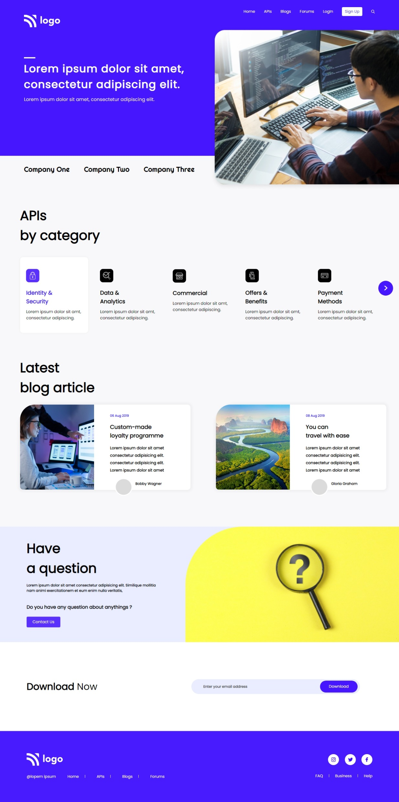

# Developer Landing Page

Hi 👋 I am Shobhan Sundar Goutam. This project is made with the help of `HTML` and `CSS`.

 

- ### Learnings from this project:-

  - Learned to use `::placeholder` selector in css.
  - Learned to use `:not()` and `:last-of-type` selectors.
  - Learned to use `relative` and `absolute` properties of CSS Positions more precisely.
  - Learned to use various flexbox properties.
  - Learned to make the website responsive with various breakpoints.

- It took around _9-10 hours_ to complete.

- Live Link:- [Developer Landing Page](https://developer-fsjs9.netlify.app/)

### Screenshot

